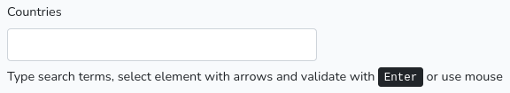

# Autocompleter

[By Sébastien L'haire](http://sebastien.lhaire.org)

A Laravel library with Javascript JQuery script to add input with auto-completer to a form.

It uses:

* a Javascript auto-complete script based on [jQuery](https://jquery.com/) Javascript framework.
* [Bootstrap](https://getbootstrap.com/) 4 / 5 CSS Framework.





Demo site available [here](https://sebastien.lhaire.org/autocompleter).

## Installation

1. `composer require seblhaire/autocompleter`
2. Composer will automatically link the package with Laravel. But you still can explicitely add provider and facade to your `config/app.php`:
```php
  'providers' => [
    ...
      Seblhaire\Autocompleter\AutocompleterServiceProvider::class,
      ...
    ],
    'aliases' => [
        ...
        "AutocompleterHelper" => Seblhaire\Autocompleter\AutocompleterHelper::class
      ]
```
3. Publish package (optionally).
``` sh
$ php artisan vendor:publish
```

4. For Javascript and stylesheets, see next section.

## Javascript ans stylesheets

On a webpage, every JS library and CSS stylesheets can be linked separately. If you choose this classical way, first dowload and install above mentionned libraries. Then publish package files as explained above and put following tags in your template:

```html
<script type="text/javascript" src="js/vendor/seblhaire/autocompleter/autocompleter.js"></script>
<link rel="stylesheet" type="text/css" property="stylesheet" href="css/vendor/seblhaire/autocompleter/autocompleter.css"/>
```

But websites often use many libraries and stylesheets and browser must download many files before the site can be rendered properly. Modern websites come with a single compressed Javascript file which concatenates necessary scripts; same principle for stylesheets. With Laravel you can use [Laravel Mix](https://github.com/JeffreyWay/laravel-mix) to compile files.

Use [NPM](https://www.npmjs.com/) package manager :
`npm install bootstrap jquery`

Then your js source file should be something like this:

```js
global.jQuery = require('jquery');
var $ = global.jQuery;
var jQuery = global.JQuery;
window.$ = $;
window.jQuery = jQuery;
require('bootstrap');
require('../../vendor/seblhaire/autocompleter/resources/js/autocompleter.js');
```

For your stylesheet:

```css
@import '~bootstrap/scss/bootstrap';

@import "../../vendor/seblhaire/autocompleter/resources/css/autocompleter";
```

## Configuration file

Autocompleter library is customizable. Default values can be changed, either in configuration file, or by passing options in Facade function (see next section). If you want to modify default configuration file, publish package files and access to `config/autocompleter.php`.

## Usage

Autocompleter package comes with a simple Facade.

### AutocompleterHelper::init

Inits an autocompleter object that can be passed to the view.

`AutocompleterHelper::init($inputid, $labeltext, $url, $options)`
where:

* `$inputid`: id of `<input>` tag which gets the autocompleter.
* `$labeltext`: input label,
* `$url`: route that must be used to load data. Set empty if static data.
* `$options` : array of options.
  *   `'labelclass'`; class of input label. Default none;
    * `'helpclass'`:  help text class. Default: 'autocompletehelp';
   * `'helptext'`:  help text below input. Text can be string or translation key. Cf [below](#translation_keys).,
   * `'divclass'`: main`<div>`class. Default: "form-group":
   *   `'inputclass'` : class of auto-complete `<input>` field. Default: 'form-control';
   *  `'resultdivclass'`: classes of `<div>`which contains results list. Default: 'sebautocomplete';
    * `'resultlistclass'`: class(es) of result list `<ul>` element. Default: 'list-group';
  *  `'resultlistclassitem'` : class(es) of list item `<li>`element. Defaut: 'list-group-item';
  * `'highliteclasses'` ; class for `<span>`to highlite search term in list. Default: 'sebautoloadhighlite';
  * `'activeitem'` : class to highlite current selected `<li>` element. Default: 'active';
   *  `'id_field'`: name of field in result line containing data identifier or key. Default: 'id',
    * `'id_included'`: id field (cf previous line) must be added to result. Default: true;
    * `'list_field'` : name of field in result line containing text to display in list. Default: 'listfield';
  * `'encoding'`character encoding of data. Default `'utf8'`;
  *  `'maxresults'`: max result number. Default: 6;
   * `'minsearchstr'`: minimum search string length to start autocompletion. Default: 1;
   *  `'callback'` : name of function to be called after a value is selected.

To summarize, in your controller insert:
```
$ac = AutocompleterHelper::init(
   'autocompleter1',
   'Countries',
   route('autocompletesearch'), // route called when typing in input
   [
    'callback' => 'output'
 ]);
 ...
 return view('autocompleter', [
      ...
     'ac' => $ac,
     ...
 ]);
```
In your blade template, insert following at the place you want the autocompleter to appear:

`{!! $ac !!}` or `{!! $ac->output() !!}`

### Output methods
#### output()
This method `output()` prints tags and outputs autocompleter initalisation script. It uses the above methods, that can be used to integrate autocompleter in other widgets, or to organize code as you wish.
#### printDiv()
This method prints the main `<div>`. It uses methods `printInsideDiv()` and  `printHelp()`

#### printInsideDiv()
Prints `<div>` that contains label, form input and result list. That container is necessary to define a fixed width. It uses methods `printLabel()`,  `printInput()` and `printResultDiv()`.

#### printHelp()
Prints help text below input line.

#### printResultDiv()
Prints results container which contains the proposal list.

####  printLabel()
Prints autocompleter label.

####  printInput()
Prints autocompleter input field.

#### printJsInit()
Prints JavaScript code to init autocompleter.

### Utils::highlite($string, $search, $classes)
Takes a string, search a susbtring in it and highlites the corresponding chunk(s)

`Utils::highlite($string, $search, $classes) : string`

where:
* `$string` is the string to highlite;
* `$search` is the substring to  search;
* `$classes` is/are the class(es) for the `<span>` tag(s) that will be inserted in the highlighted string.

The function returns the highlighted string.

## Search function
You must build a simple method in a controller that will be called to update result lists. Here are a few requirements:
1. your route has to accept the POST method;
2. two parameters only are built in the autocompleter object:
   *  'search' contains the current string in input;
   * 'maxresults'  is an integer for the maximum of results acceptable for the autocompleter.
  We provide a request model  AutocompleterRequest to perform form validation.
 3.  the method must return a json object with a single field named 'res' which contains an array of result lines.
 4. result lines are an array which must contain at least the following fields:
   * a field whose key corresponds to the config value `id_field`  (cf. above) (`config('autocompleter.highliteclasses')`);
   * a field whose key corresponds to the config value `list_field`, which contains the text for the autocompleter result list. If `id_included` has value `true` in config, the autocompleter object will add automatically the `id_field` value. In this field you can use the above mentioned function `Utils::highlite`.
To summarize here is a complete example:     
```
use Seblhaire\Autocompleter\AutocompleterRequest;
...
public function search(AutocompleterRequest $request){
  $search = $request->input('search');
  $countries = collect(Countries::getList())->filter(function($data) use ($search){ //search in country list
    return (mb_stripos($data['code'], $search) !== false) || (mb_stripos($data['country'], $search) !== false);
  })->take($request->input('maxresults'));
  $res = [];
  if (count($countries) > 0){
    foreach  ($countries as $country){
      $res[] = [
        config('autocompleter.id_field') => $country['code'],
        'country' => $country['country'], // other value available
        config('autocompleter.list_field') => Utils::highlite($country['code'] . ' : ' . $country['country'], $request->input('search'), config('autocompleter.highliteclasses'))
      ];
    }
  }
  return response()->json(['res'  => $res]);
}
```
## Translation keys

Laravel loads config files very early in process. Therefore config files cannot contain `__('translation.key')`. In order to solve this issue, we made an helper either to print directly strings or to send translation key to translation helper. Translation keys can be delimited by character \# . Ex: `"#autocompleter::messages.autocompleterhelp#"`. Original translations are stored under `vendor/seblhaire/autocompleter/resources/lang`. If you publish package files, you can find translations in `resources/lang/vendor/autocompleter/`.

Feel free to translate keys in your own language and either to send it to the author or to do a merge request on GitHub.

# Questions? Contributions?

Feel free to send feature requests or merge request to the author or simply to ask questions.
